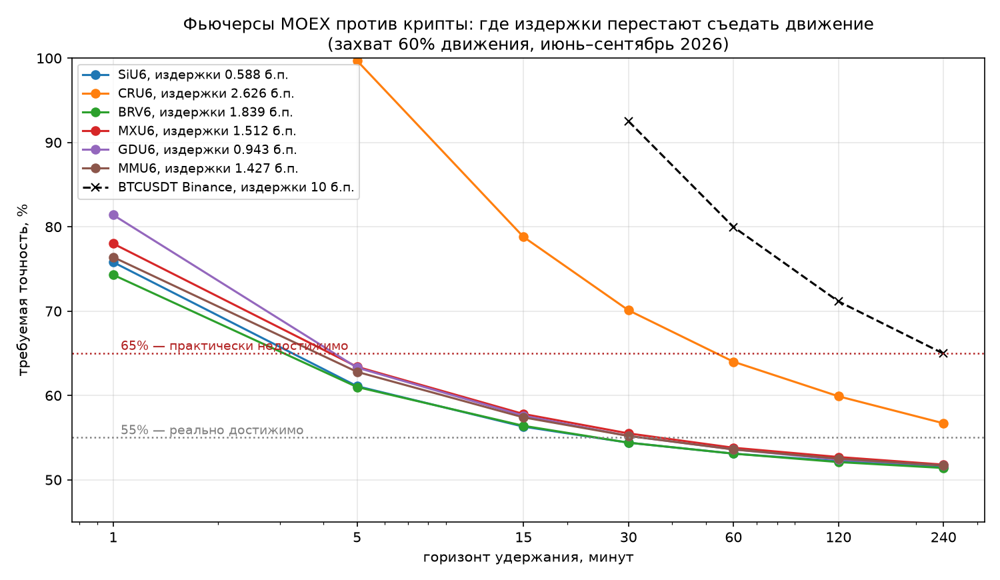
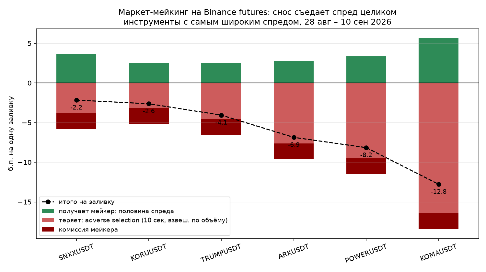
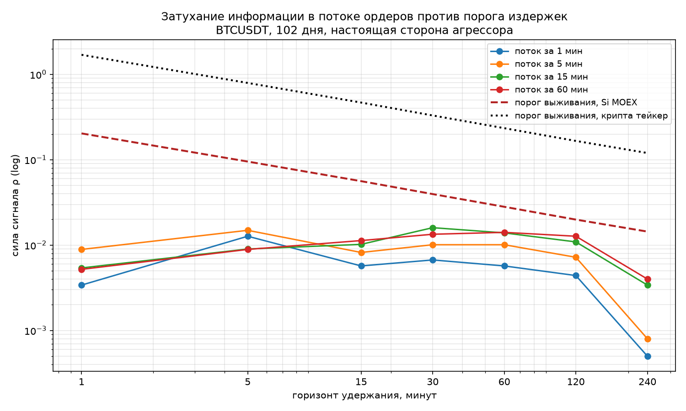
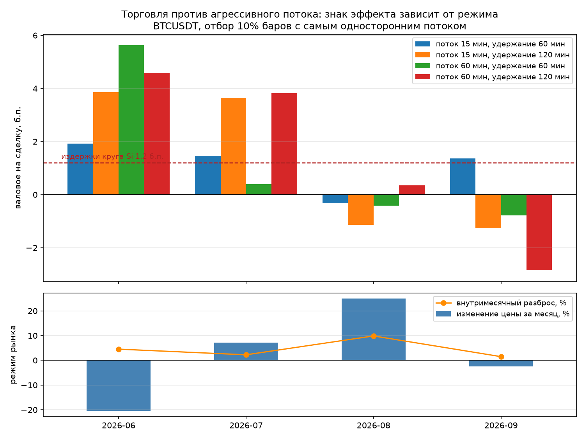

# Orderflow: five hypotheses, five refutations

*Read this in [Russian / по-русски](README.ru.md).*

This is a research log, not a trading strategy. Over the course of this project I formulated five
hypotheses about extracting returns from market microstructure, and closed all five — four on
measured data, one on structural grounds. Every negative result below is reproducible from the code
in this repository.

I am publishing it because the failures are the useful part. The reasoning that kills a hypothesis
before it costs money is the same reasoning that would validate a real one, and almost nobody shows
that half of the work.

## The rules I held to

These are not stylistic preferences. Each one exists because violating it manufactures an edge that
is not there.

- **Compute the breakeven threshold before writing any strategy code.** If the required accuracy on
  a given horizon exceeds 60–65%, the problem is almost certainly unsolvable and no amount of model
  complexity will change that.
- **Compute statistical power before collecting data.** How large an edge can this sample size even
  detect? I did this after starting collection, which was a mistake, and I say so in the code.
- **Enter on the next bar's open, never the signal bar's close.** Otherwise you are looking into the
  future.
- **Derive thresholds from a rolling window of the past, not from the full sample.**
- **Bootstrap confidence intervals over day blocks.** Overlapping horizons inflate a naive t-statistic
  several times over.
- **Subtract costs first.** Gross numbers mean nothing.

## What I found

### 1. The cost floor decides the game before the model does

Required directional accuracy, assuming a trade captures 60% of the average absolute move over the
horizon:

| Instrument | Round-trip cost | Required accuracy @ 1 min | @ 30 min | @ 240 min |
|---|---|---|---|---|
| SiU6 (MOEX, USD/RUB) | 0.588 bps | 76% | 55.6% | 51.7% |
| GDU6 (MOEX, gold) | 0.943 bps | 81% | 55.5% | 51.8% |
| CRU6 (MOEX) | 2.626 bps | >100% | 70.1% | 56.7% |
| BTCUSDT (Binance, taker) | 10 bps | far above 100% | 92.4% | 65.0% |

Two conclusions. Taker-side directional trading in crypto is closed by fees alone — needing 65%
accuracy at a four-hour horizon is not a modelling problem, it is an arithmetic one. And on cheap
MOEX futures the arithmetic only becomes survivable at horizons of 30 minutes and longer.

Hold on to that second point, because it is about to collide with the next finding.



### 2. Market making on liquid alts loses money on every instrument tested

A maker always fills against the aggressor, so the return on a fill is half the spread, minus the
adverse price drift over the markout window, minus fees. Measured over ~6.0M fills across six
Binance USDT-M perpetuals at markouts of 1, 5, 10 and 60 seconds:

| | Range across instruments |
|---|---|
| Half-spread earned | 2.52 – 5.64 bps |
| Volume-weighted adverse drift | 2.52 – 16.42 bps |
| **Net per round trip** (incl. 2 bps maker fee) | **−3.75 to −14.78 bps** |

Every instrument, every markout, negative. Not marginal — negative by multiples of the spread being
captured.

The instructive detail is the gap between weighted and unweighted drift. Unweighted, the drift often
looks smaller than the half-spread, which makes the scheme appear viable. Volume-weighted, it is two
to three times larger. The fills you actually get are precisely the ones that hurt you: adverse
selection is concentrated in large aggressive orders, so averaging over fills rather than over
volume hides the whole problem.



### 3. Funding carry pays less than a bank deposit

Buy spot, sell the perpetual, collect funding, take no directional risk. The economics here are
fully transparent — the rate is known in advance rather than estimated by a model — which makes it
the only honest income scheme in crypto. It is also, currently, not worth doing:

| Symbol | Annualized, full history | Annualized, last year | Negative periods |
|---|---|---|---|
| BTCUSDT | 11.6% | 3.4% | 14% |
| ETHUSDT | 13.8% | 2.4% | 14% |
| SOLUSDT | 0.2% | −1.8% | 29% |

Full history since the 2019 launch of USDT-M futures. A scheme yielding 2–3% while carrying exchange
and liquidation risk is dominated by instruments that carry neither.

### 4. Order flow imbalance never reaches its own survival threshold

This was the fifth hypothesis, and the one I most expected to work. The measurement: ρ, the
correlation between order flow imbalance over a trailing window and the subsequent price move. The
survival threshold is ρ_required = cost / σ_horizon — the signal has a right to exist only where
measured ρ exceeds it.

Measured on 102 days of BTCUSDT with genuine aggressor side, across accumulation windows of 1, 5, 15
and 60 minutes and horizons from 1 to 240 minutes:

- **Measured ρ: 0.003 – 0.016**, roughly flat from 1 to 120 minutes, collapsing at 240.
- **Threshold at Si MOEX costs (1.2 bps): 0.2 at 1 minute, falling to 0.015 at 240 minutes.**
- **Threshold at crypto taker costs (10 bps): 0.12 even at 240 minutes** — an order of magnitude
  above anything measured.

The two curves never meet. They are closest at the 240-minute horizon, where the threshold has
fallen to ~0.015 and measured ρ has fallen to ~0.004 — still short by a factor of four.

This is the collision promised in finding 1. Costs push you toward horizons of 30 minutes and
longer. But order flow is the shortest-lived class of information that exists — aggression in the
book resolves in seconds. The requirement and the signal move in opposite directions, and the
hypothesis dies in the gap between them. Structurally, not marginally.



### 5. What looked like an edge was a regime in disguise

The finding that settled it. Taking the 10% of bars with the most one-sided flow and trading against
it, broken out by month:

| Month | Price move | Gross per trade |
|---|---|---|
| 2026-06 | −20% | +1.9 to +5.6 bps |
| 2026-07 | +7% | +0.4 to +3.8 bps |
| 2026-08 | +24% | −1.1 to +0.3 bps |
| 2026-09 | −3% | −2.9 to +1.3 bps |

*Values read from the monthly breakdown; see the chart.*

The sign of the effect tracks the direction of the market. Trading against aggressive flow is
profitable in falling months and unprofitable in rising ones — which means it is not an edge, it is
an undeclared bet on mean reversion, and it pays only in regimes where mean reversion happens to
dominate. Four months is nowhere near enough to know the regime in advance, and a strategy that
requires knowing it has simply relocated the original problem.



## What got built along the way

The infrastructure outlived the hypotheses and is the reusable part of this project:

- **MOEX tick collector with true aggressor side** for nine futures, selected by round-trip cost
  rather than turnover (Eu 0.54, Si 0.59, GD 0.94, ED 1.30, MM 1.43, GN 1.43, MX 1.51, BR 1.84,
  CR 2.63 bps). Runs on a systemd timer every 15 minutes, exits outside session hours on its own,
  merges by `TRADENO` so server and local data never overwrite each other.
- **A watchdog** that catches silent collection failure — the kind that otherwise surfaces a month
  later, when the data you were counting on turns out not to exist.
- **A risk interlock** that reads its limits from a file, because constraints that live only in
  intentions get revoked at exactly the moment they need to hold: after a losing streak you want to
  win it back, after a winning streak you want more size. Both urges are natural and both are ruinous.
- **A broker sandbox check** that walks the full order lifecycle and prints measured values rather
  than assumed ones.

## What would change the conclusions

Stating this is part of the method — a hypothesis I cannot describe how to revive is a hypothesis I
have not actually understood.

- Measured ρ on MOEX rather than transferred qualitatively from crypto. The shape of the decay curve
  is a microstructure property and transfers; the level does not. The collector exists for exactly
  this, and one session is not a sample.
- A cost structure genuinely below MOEX exchange fees, i.e. maker rebates or exchange membership.
  The thresholds above are not laws of nature; they are functions of cost.
- A signal from a different information class with a longer half-life. Order flow is the wrong class
  for the horizons the cost floor forces you onto — that is finding 4 restated as a direction rather
  than a wall.

## Repository map

| Path | What it does |
|---|---|
| `src/orderflow/feasibility.py` | Breakeven accuracy vs cost, per horizon. Run this first, always. |
| `src/orderflow/moex_feasibility.py` | Same, on real MOEX fees and tick sizes. |
| `src/orderflow/power.py` | Sample size needed to detect a given edge. |
| `src/orderflow/decay.py` | ρ(window, horizon) against the survival threshold. |
| `src/orderflow/mm_screen.py` | Screens instruments where half-spread exceeds the maker fee. |
| `src/orderflow/mm_edge.py` | Maker economics: spread minus adverse selection minus fees. |
| `src/orderflow/funding.py` | Perpetual funding history and carry yield. |
| `src/orderflow/edge.py` | Absorption signal test, with the methodology rules enforced. |
| `src/orderflow/footprint.py` | Bars with delta from tick data. |
| `src/orderflow/moex_ticks.py` | Tick collection with aggressor side. |
| `src/orderflow/watchdog.py` | Integrity check on collected ticks. |
| `src/orderflow/risk.py` | Pre-order risk interlock. |
| `src/orderflow/broker.py`, `broker_check.py` | Execution layer and sandbox verification. |
| `deploy/` | Server install and sync for unattended collection. |

## Running it

```bash
uv sync
uv run python src/orderflow/feasibility.py
```

Tick and candle data is cached under `data/` and not committed — the futures cache alone is several
hundred megabytes. Charts in `reports/` are committed and correspond to the findings above.
